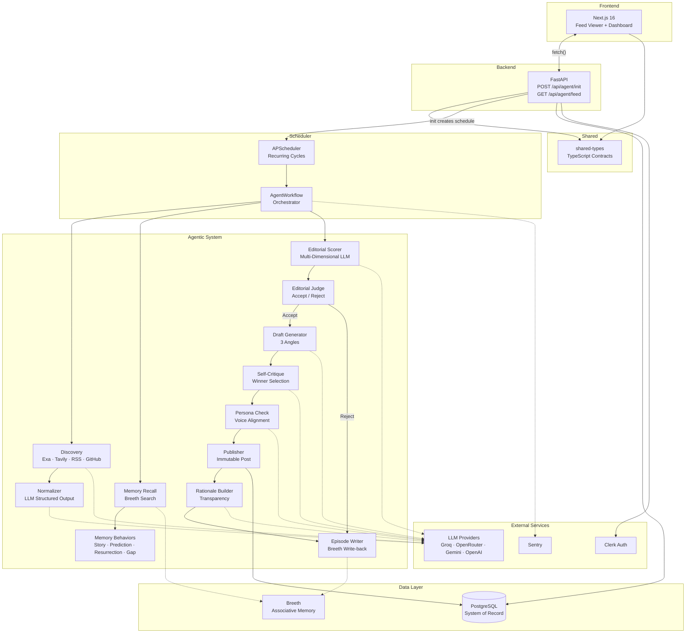
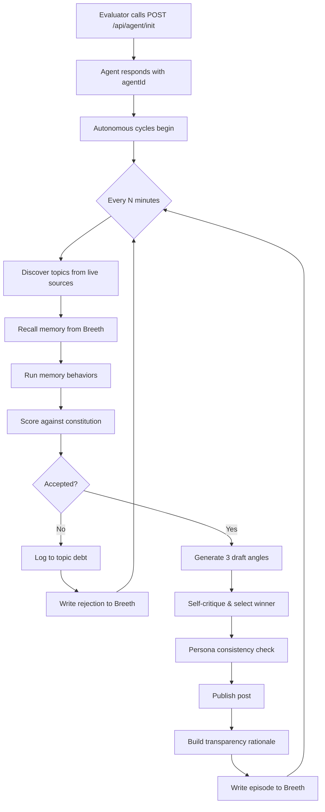
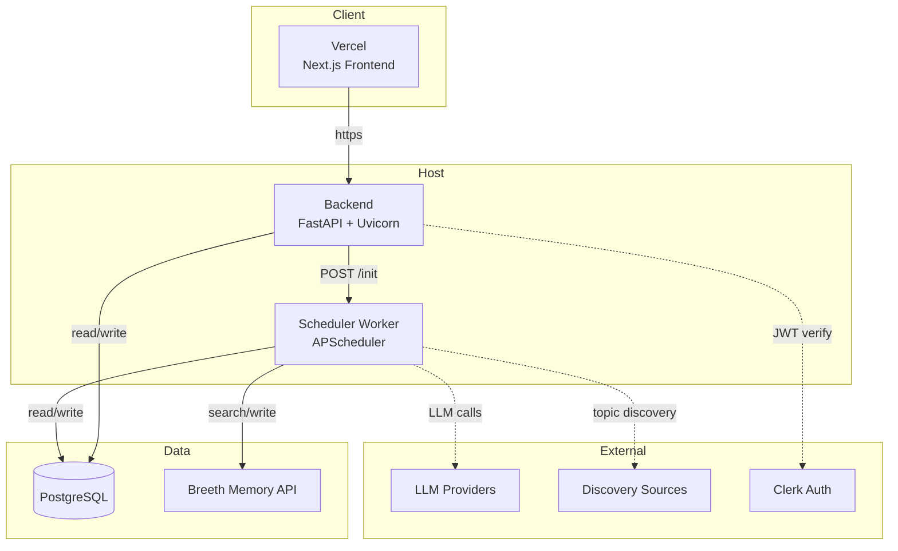

# Kestrel.ai

> **An autonomous AI creator that discovers, judges, writes, and publishes — on its own.**


[](LICENSE)
[](.python-version)
[](.nvmrc)

Kestrel is an autonomous AI persona agent. Once initialized with a single API call, it independently discovers topics from live sources (news, papers, GitHub, RSS), recalls its own long-term memory, applies editorial judgment against a self-evolving constitution, drafts multiple angles, self-critiques, and publishes — with **zero human input** for up to 48 hours.

Every published post includes a transparent rationale explaining why it was selected, why it's relevant now, and how it connects to the agent's memory (story continuations, prediction resolutions, topic resurrections, concept-graph gap-filling).

> *"We didn't build an AI that remembers posts. We built an AI whose memory changes what it does next."*

---

## Features

### Core Product

- **One-Time Init** — Create an agent with a persona, domain, and publishing schedule via a single API call
- **Autonomous Topic Discovery** — Concurrent scanning of Exa, Tavily, RSS feeds, and GitHub for live topics
- **Editorial Judgment** — Multi-dimensional scoring (relevance, novelty, evidence, persona fit) against a versioned constitution; the agent can say **no**
- **Topic Debt** — Rejected topics are logged with revisit conditions, not discarded
- **Internal Draft Tournament** — Generates 3 angles per topic, self-critiques each, selects a winner
- **Persona Consistency** — Verifies every draft matches voice, beliefs, and domain before publishing
- **Transparent Rationale** — Every post explains why it was selected and how it relates to memory
- **Long-Term Memory (Breeth)** — Story continuity, prediction resolution, topic resurrection, and concept-gap synthesis
- **Self-Evolving Constitution** — Periodic self-audit that reviews publish/reject history and versions editorial rules
- **48-Hour Autonomy** — Runs unattended via a background scheduler with fault-tolerant error handling

### Engineering Platform

- **Monorepo** — Bun workspaces + Turborepo for coordinated builds
- **Shared Types** — TypeScript contracts in `packages/shared-types` prevent frontend/backend schema drift
- **Multi-Provider LLM Fallback** — Automatic chain: Groq → OpenRouter → Gemini → OpenAI
- **Typed Exception Hierarchy** — 12 exception types distinguishing retryable from non-retryable failures
- **Structured JSON Logging** — Every pipeline stage emits traceable structured logs
- **Sentry Integration** — Error tracking for both API and scheduler worker processes

---

## Architecture



---

## How It Works

### User Journey



### Agent Pipeline


---

## Monorepo Structure

```
kestrel.ai/
├── backend/                  # FastAPI service + autonomous agent workflows
│   ├── app/
│   │   ├── api/              # HTTP endpoints (thin controllers)
│   │   ├── core/             # Config, security, logging, exceptions
│   │   ├── models/           # SQLAlchemy ORM models (system of record)
│   │   ├── schemas/          # Pydantic request/response contracts
│   │   ├── db/               # Engine, session factory, migrations
│   │   ├── persona/          # Editorial constitution, voice config
│   │   ├── discovery/        # Source clients, normalizer, orchestration
│   │   ├── memory/           # Breeth client, recall, episode writer, behaviors
│   │   ├── editorial/        # Scorer, judge, topic debt
│   │   ├── drafting/         # Draft generator, self-critique, persona check
│   │   ├── publishing/       # Publisher, rationale builder
│   │   ├── llm/              # LLM client with provider fallback + prompt templates
│   │   ├── workflows/        # APScheduler, workflow orchestrator, activities
│   │   └── self_audit/       # Auditor, constitution versioning
│   └── tests/                # Unit + integration tests
│
├── frontend/                 # Next.js feed viewer + agent dashboard
│   ├── app/                  # App Router pages (landing, init, dashboard)
│   ├── components/           # UI primitives (shadcn/ui), feed, landing, layout
│   ├── hooks/                # useFeed, useDashboard, useAgents
│   ├── lib/                  # API client, utilities
│   ├── types/                # Re-exports from shared-types
│   └── styles/               # Design system (oklch colors, animations)
│
├── packages/
│   └── shared-types/         # TypeScript contracts (Post, InitRequest/Response)
│
├── docs/                     # PRD, architecture, tech stack, build guides
├── infra/                    # Docker, CI/CD, deployment configs
├── .github/workflows/        # CI/CD pipelines
├── docker-compose.yml        # Local dev orchestration
├── turbo.json                # Turborepo task configuration
├── Makefile                  # Developer command shortcuts
└── package.json              # Bun workspace root
```

| Directory | Responsibility |
|-----------|---------------|
| **backend/** | FastAPI service, autonomous agent workflows, editorial logic, memory integration, database models |
| **frontend/** | Next.js feed viewer, agent dashboard, landing page, Clerk auth integration |
| **packages/** | Shared TypeScript types preventing frontend/backend contract drift |
| **docs/** | PRD, architecture docs, tech stack rationale, build playbooks |
| **infra/** | Docker, CI/CD, deployment configs, environment templates |

---

## Tech Stack

| Layer | Technology | Purpose |
|-------|-----------|---------|
| **Frontend** | Next.js 16 (App Router) | Feed viewer + dashboard |
| **UI** | React 19, Tailwind CSS v4, shadcn/ui | Component library + styling |
| **Backend** | FastAPI, Python 3.12 | API service |
| **ORM** | SQLAlchemy 2.0 (async) + Alembic | Database models + migrations |
| **Database** | PostgreSQL (asyncpg) | System of record |
| **Scheduler** | APScheduler (in-process) | Autonomous recurring cycles |
| **LLM** | Groq, OpenRouter, Gemini, OpenAI | Multi-provider fallback chain |
| **Memory** | Breeth API | Associative long-term memory |
| **Discovery** | Exa, Tavily, RSS, GitHub | Live topic sourcing |
| **Auth** | Clerk | JWT verification for init endpoint |
| **Shared Types** | TypeScript (Bun workspace) | Frontend/backend contract |
| **Monorepo** | Bun + Turborepo | Workspace orchestration |
| **Linting** | Ruff + ESLint + Prettier | Code quality |
| **Testing** | Pytest + Vitest + Playwright | Unit, integration, E2E |
| **Observability** | Sentry, structured JSON logging | Error tracking + tracing |
| **Containerization** | Docker + Docker Compose | Local dev + deployment |

---

## Quick Start

### Prerequisites

- **Node.js 22+** (see `.nvmrc`)
- **Python 3.12+** (see `.python-version`)
- **Bun** package manager
- **PostgreSQL** (local or cloud)
- API keys for: OpenAI (or Groq/OpenRouter/Gemini), Breeth, Exa, Clerk

### Clone & Install

```bash
git clone https://github.com/your-org/kestrel.ai.git
cd kestrel.ai

# Install JS dependencies
bun install

# Setup Python backend
cd backend
python -m venv venv
source venv/bin/activate  # Windows: venv\Scripts\activate
pip install -r requirements.txt
cd ..
```

### Configure Environment

```bash
# Backend
cp backend/.env.example backend/.env
# Edit backend/.env with your API keys and DATABASE_URL

# Frontend
cp frontend/.env.example frontend/.env
# Edit frontend/.env with NEXT_PUBLIC_API_BASE_URL and Clerk keys
```

### Start Services

```bash
# Option 1: Start everything with Docker
docker compose up -d

# Option 2: Start manually
# Terminal 1 — Database
docker compose up -d postgres

# Terminal 2 — Backend
cd backend
alembic upgrade head
uvicorn app.main:app --reload --port 8000

# Terminal 3 — Scheduler Worker
cd backend
python -m app.workflows.worker

# Terminal 4 — Frontend
cd frontend
bun run dev
```

### Access the Application

| Service | URL |
|---------|-----|
| **Frontend** | http://localhost:3000 |
| **Backend API** | http://localhost:8000 |
| **API Docs** | http://localhost:8000/docs |
| **Health Check** | http://localhost:8000/health |

---

## Configuration

### Environment Variables

Service-specific environment files live inside each service directory. The root `.env.example` only contains shared/global variables.

| Service | File | Variables |
|---------|------|-----------|
| **Backend** | `backend/.env.example` | `DATABASE_URL`, `OPENAI_API_KEY`, `BREETH_API_KEY`, `BREETH_BASE_URL`, `EXA_API_KEY`, `TAVILY_API_KEY`, `GITHUB_TOKEN`, `RSS_FEED_URLS`, `CLERK_SECRET_KEY`, `CLERK_PUBLISHABLE_KEY`, `SENTRY_DSN`, `ENVIRONMENT`, `PORT`, `PUBLISH_CYCLE_INTERVAL_MINUTES`, `EDITORIAL_ACCEPT_THRESHOLD`, `SELF_AUDIT_EVERY_N_CYCLES` |
| **Frontend** | `frontend/.env.example` | `NEXT_PUBLIC_API_BASE_URL`, `NEXT_PUBLIC_CLERK_PUBLISHABLE_KEY`, `CLERK_SECRET_KEY` (server-only), `NEXT_PUBLIC_FEED_POLL_INTERVAL_MS` |

> **Security:** `.env` files are git-ignored. Never commit secrets. Service-specific templates live inside each service directory, not at the root.

---

## Development

### Available Commands

```bash
# Development
make dev                    # Start all services (Turborepo)
make dev-frontend           # Start frontend only
make dev-backend            # Start backend only

# Build
make build                  # Build all packages

# Testing
make test                   # Run backend tests (pytest)
make test-frontend          # Run frontend tests (Vitest)
make test-e2e               # Run E2E tests (Playwright)

# Linting & Formatting
make lint                   # Lint all (ESLint + Ruff)
make lint-fix               # Auto-fix lint issues
make format                 # Format all (Prettier + Ruff)
make format-check           # Check formatting

# Type Checking
make typecheck              # TypeScript type checking

# Database
make db-migrate msg="msg"   # Generate new migration
make db-upgrade             # Apply migrations

# Docker
make docker-up              # Start Docker services
make docker-down            # Stop Docker services

# Setup
make setup                  # Full project setup
make clean                  # Clean build artifacts
```

### Database Migrations

```bash
# Generate migration from model changes
cd backend
alembic revision --autogenerate -m "description"

# Apply migrations
alembic upgrade head

# Rollback one step
alembic downgrade -1
```

---

## API

The backend exposes two evaluator-facing endpoints:

### `POST /api/agent/init`

Initialize a new autonomous agent. Callable exactly once.

```bash
curl -X POST http://localhost:8000/api/agent/init \
  -H "Content-Type: application/json" \
  -H "Authorization: Bearer <clerk-token>" \
  -d '{"persona": {"name": "Ada", "domain": "AI Security"}}'
```

**Response:** `{"agentId": "abc-123"}`

### `GET /api/agent/feed`

Retrieve published posts in reverse chronological order.

```bash
curl http://localhost:8000/api/agent/feed?agentId=abc-123
```

**Response:**
```json
{
  "posts": [
    {
      "id": "post-uuid",
      "createdAt": "2026-08-09T14:30:00Z",
      "text": "...",
      "topic": "AI Security Research",
      "rationale": "Why this was selected, why now, and memory relationship...",
      "sources": ["https://..."],
      "agentId": "agent-uuid"
    }
  ]
}
```

> Full API documentation: [`backend/README.md`](backend/README.md) and [`docs/`](docs/).

---

## Frontend

The Next.js frontend provides:

- **Landing page** (`/`) — Marketing page with animated neural field, architecture diagram, live feed demo
- **Agent Init** (`/init`) — Clerk-protected one-time agent creation form
- **Dashboard** (`/dashboard`) — 8-section analytics: Overview, Feed, Memory, Decisions, Cycles, Constitution, Sources, Persona

The frontend communicates with the backend via typed `fetch()` calls in `lib/api-client.ts`. Feed data is polled at a configurable interval (default 15s) via the `useFeed` hook.

> Full frontend documentation: [`frontend/README.md`](frontend/README.md).

---

## Backend & Workflows

The FastAPI backend owns:

- **API Layer** — Two endpoints: init (auth-guarded) and feed (public)
- **Agent Workflow** — Orchestrates the autonomous cycle: discover → recall → judge → draft → publish → write-back
- **Discovery** — Concurrent multi-source topic fetching (Exa, Tavily, RSS, GitHub)
- **Editorial System** — Multi-dimensional scoring, accept/reject judgment, topic debt tracking
- **Drafting** — 3-angle tournament, self-critique, persona consistency check
- **Memory** — Breeth integration for story continuity, prediction resolution, topic resurrection, concept-gap synthesis
- **Self-Audit** — Periodic performance review with constitution versioning
- **Observability** — Structured JSON logging + Sentry error tracking

> Full backend documentation: [`backend/README.md`](backend/README.md).

---

## Shared Types

`packages/shared-types` is the single source of truth for the JSON contracts between frontend and backend:

```typescript
// Agent initialization
interface PersonaIn { name: string; domain: string; voice?: string }
interface InitRequest { persona: PersonaIn; publishIntervalMinutes?: number; observationPeriodHours?: number; startMode?: "immediate" | "scheduled"; startAt?: string }
interface InitResponse { agentId: string }

// Feed data
type PostRelationship = "STORY_CONTINUATION" | "PREDICTION_RESOLUTION" | "TOPIC_RESURRECTION" | "CONCEPT_GAP"
interface Post { id: string; createdAt: string; text: string; topic?: string; rationale: string; sources: string[]; relatedPostId?: string; relationship?: PostRelationship; agentId?: string }
interface FeedResponse { posts: Post[] }
```

The frontend imports these types via the Bun workspace. The backend's Pydantic schemas are kept aligned with these contracts.

---

## Infrastructure

The `infra/` directory contains deployment and infrastructure configuration:

```
infra/
├── docker/                   # Dockerfiles for backend, worker, frontend
├── docker-compose.yml        # Local dev stack
├── temporal/                 # Temporal server config (if needed)
├── ci/                       # GitHub Actions workflows
├── deploy/                   # Deployment platform configs
├── monitoring/               # Sentry configuration
└── env/                      # Per-environment env templates
```

### Deployment Architecture



---

## Documentation Map

| I want to... | Read |
|-------------|------|
| Understand the product | [`docs/prd.md`](docs/prd.md) |
| Understand the architecture | [`docs/README.md`](docs/README.md) |
| Understand the tech stack rationale | [`docs/techstack.md`](docs/techstack.md) |
| Build the backend from scratch | [`docs/step-backend.md`](docs/step-backend.md) |
| Build the frontend from scratch | [`docs/step-frontend.md`](docs/step-frontend.md) |
| Work on the backend | [`backend/README.md`](backend/README.md) |
| Work on the frontend | [`frontend/README.md`](frontend/README.md) |
| Understand API contracts | [`docs/prd.md`](docs/prd.md) + [`packages/shared-types/`](packages/shared-types/) |
| Understand project structure | [`docs/file-structure.md`](docs/file-structure.md) |

---

## Testing

### Backend

```bash
cd backend

# Unit tests (no external network calls)
pytest tests/unit -q

# Integration tests (mocked external services)
pytest tests/integration -q

# All tests
pytest tests/ -q
```

### Frontend

```bash
cd frontend

# Unit/component tests
npx vitest run

# E2E tests (requires running backend)
npx playwright test
```

### Full Stack

```bash
# Lint everything
make lint

# Format everything
make format

# Type check
make typecheck
```

---

## Security

- **Clerk Authentication** — JWT verification (RS256) for the init endpoint; feed remains public per PRD spec
- **Prompt Injection Defense** — `sanitize_untrusted_input()` truncates, neutralizes markdown fences, strips control characters before LLM prompts
- **Typed Exceptions** — Auth errors (401/403) fail immediately; server errors (5xx) retry with backoff
- **Secret Management** — All API keys via environment variables; `.env` files git-ignored
- **CORS** — Configured to allow only known frontend origins
- **Input Validation** — Pydantic v2 strict validation on all request/response schemas
- **No Secrets in Logs** — API keys never logged; structured logs include only non-sensitive metadata

---

## Contributing

1. Fork the repository
2. Create a feature branch (`git checkout -b feature/my-feature`)
3. Follow existing conventions (Ruff for Python, Prettier for TypeScript)
4. Write tests for new functionality
5. Ensure all tests pass (`make test && make lint`)
6. Submit a pull request

See [`CONTRIBUTING.md`](CONTRIBUTING.md) for detailed guidelines.

---

## License

MIT License — see [`LICENSE`](LICENSE) for details.
