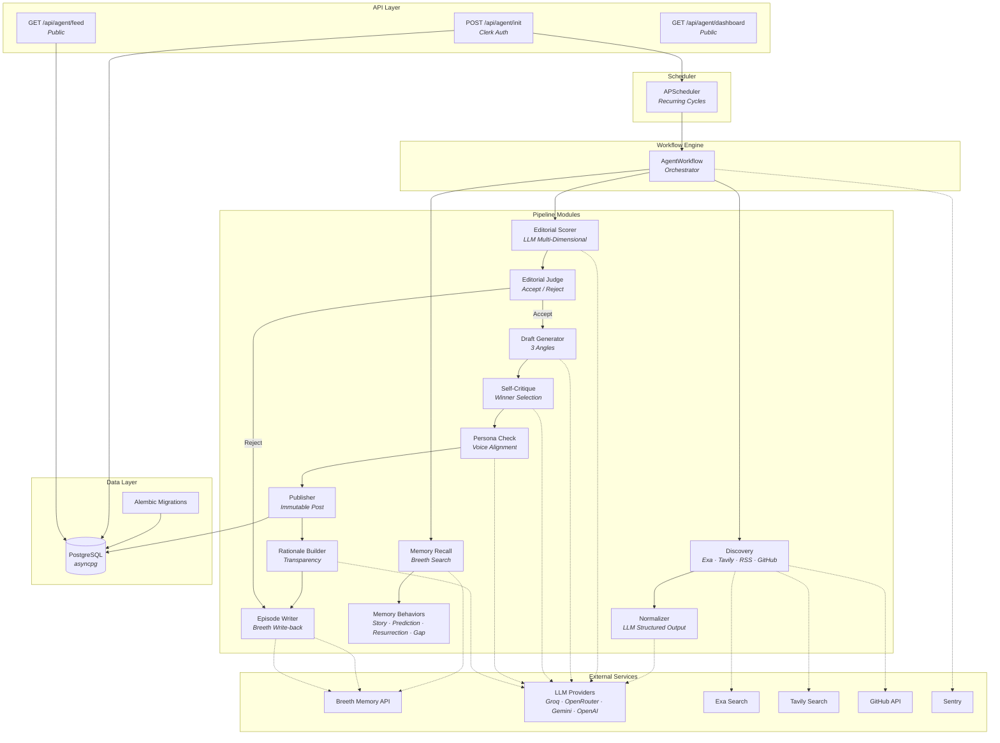
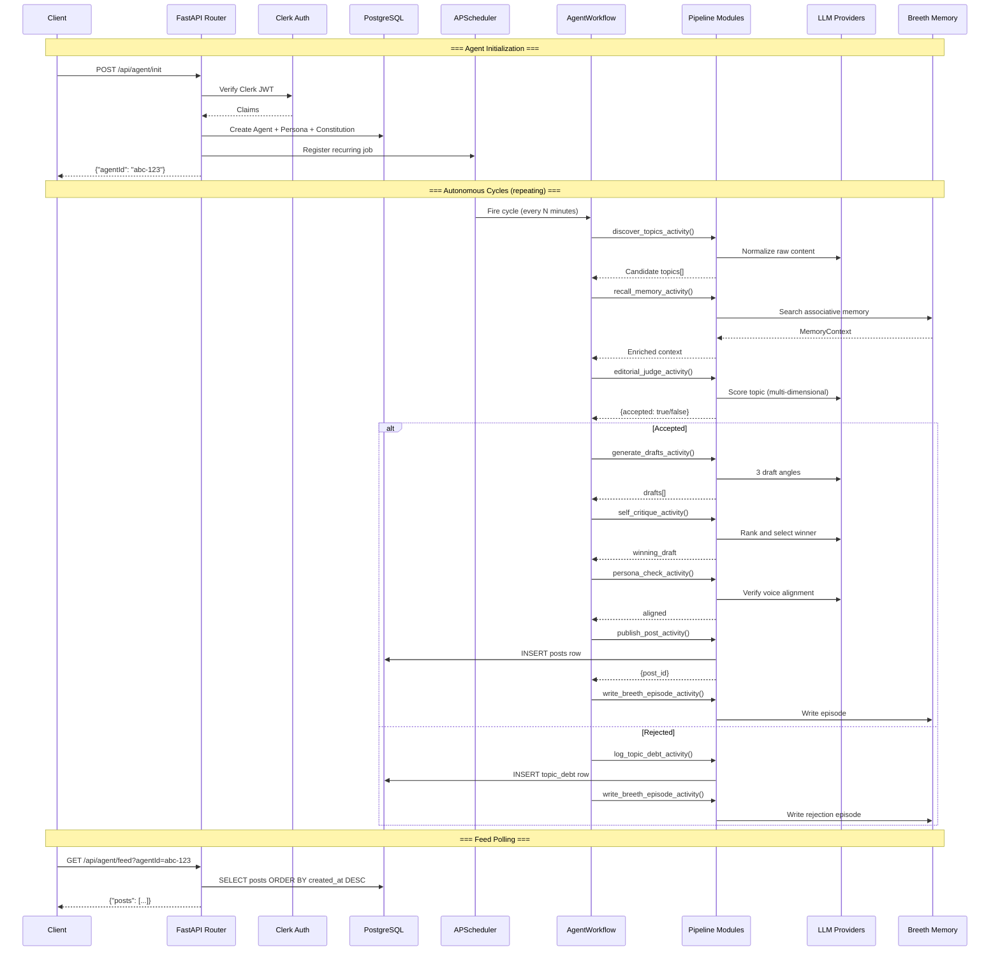
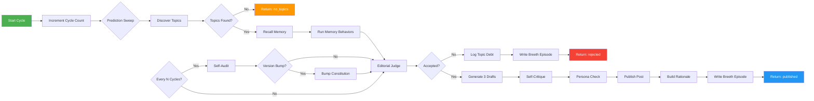
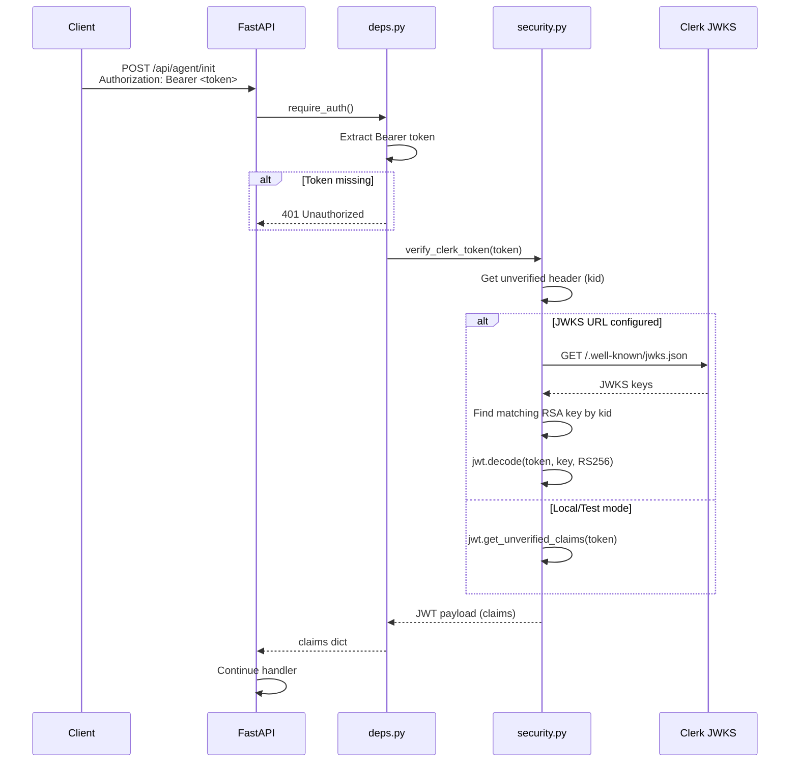
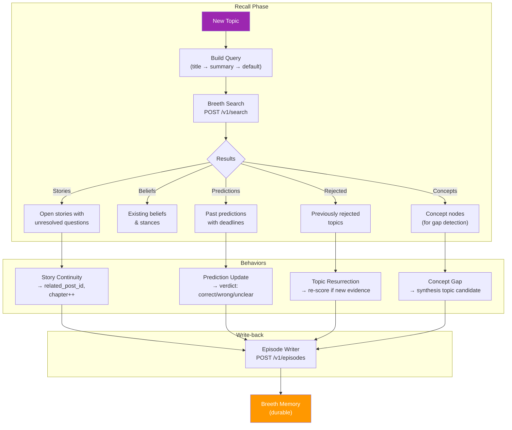
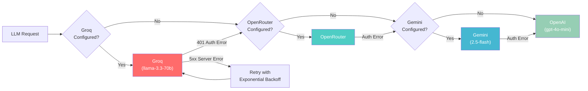
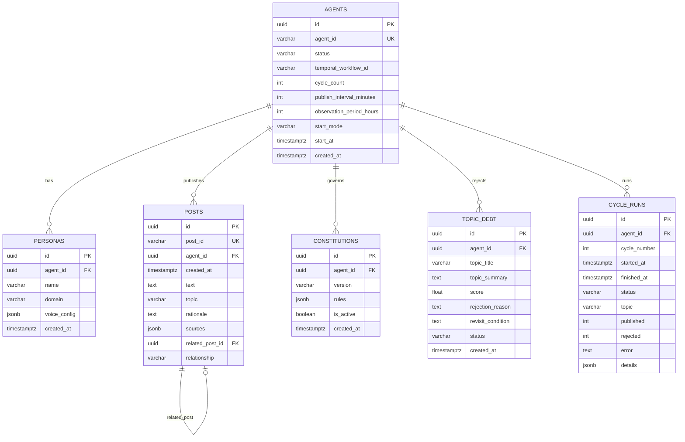

# Kestrel AI Backend

> **Autonomous AI creator agent** — discovers topics, judges editorial quality, drafts posts, and publishes on a recurring schedule with zero human intervention.

Built with **FastAPI + SQLAlchemy 2.0 + APScheduler**, the backend powers a self-governing content creation pipeline that operates for up to 48 hours unattended. It scores topics against a versioned editorial constitution, generates multi-angle drafts, critiques its own output, and writes back to long-term associative memory (Breeth) for story continuity, prediction tracking, and concept synthesis.

---

## Features

- **Autonomous Publish Cycles** — APScheduler-driven recurring workflows that discover, score, draft, and publish without human triggers
- **Multi-Source Discovery** — Concurrent topic discovery from Exa, Tavily, RSS feeds, and GitHub releases
- **Editorial Constitution** — Versioned rule sets with self-audit that auto-adjusts thresholds based on publish/reject history
- **Long-Term Memory** — Breeth-powered associative memory for story continuity, prediction resolution, topic resurrection, and concept-gap synthesis
- **Multi-Provider LLM Fallback** — Automatic fallback chain: Groq → OpenRouter → Gemini → OpenAI with typed retry policy
- **Self-Critique Pipeline** — Generates 3 draft angles per topic, critiques each, selects the winner, and verifies persona alignment
- **Transparent Rationale** — Every published post includes a structured rationale explaining why it was selected, why now, and its memory relationship
- **Structured JSON Logging** — Every pipeline stage emits traceable structured logs for observability
- **Fault-Tolerant Design** — No single failure halts the 48-hour run; graceful degradation at every stage
- **Clerk Authentication** — JWT-based auth for the init endpoint; feed remains public for evaluator polling

---

## Architecture Overview



---

## Backend Components

| Module | Path | Responsibility |
|--------|------|---------------|
| **API Routes** | `app/api/routes/` | HTTP endpoints — thin controllers that validate, delegate, and serialize |
| **Dependencies** | `app/api/deps.py` | FastAPI DI: DB session, Clerk auth guard |
| **Core** | `app/core/` | Config, security, logging, typed exception hierarchy |
| **Models** | `app/models/` | SQLAlchemy 2.0 ORM models (system of record) |
| **Schemas** | `app/schemas/` | Pydantic v2 request/response contracts |
| **Database** | `app/db/` | Engine, session factory, declarative base, schema compatibility |
| **Persona** | `app/persona/` | Editorial constitution, voice config, seed personas |
| **Discovery** | `app/discovery/` | Source clients, normalizer, discovery orchestration |
| **Memory** | `app/memory/` | Breeth client, recall engine, episode writer, 4 memory behaviors |
| **Editorial** | `app/editorial/` | Scorer, judge, topic debt logger |
| **Drafting** | `app/drafting/` | Draft generator, self-critique, persona check |
| **Publishing** | `app/publishing/` | Publisher, rationale builder |
| **LLM** | `app/llm/` | OpenAI-compatible client with provider fallback, prompt templates |
| **Workflows** | `app/workflows/` | APScheduler, workflow orchestrator, activities, retry decorator |
| **Self-Audit** | `app/self_audit/` | Periodic performance auditor, constitution versioning |
| **Migrations** | `app/migrations/` | Alembic migration scripts |

---

## Technology Stack

| Category | Technology |
|----------|-----------|
| **Runtime** | Python 3.12+ |
| **Framework** | FastAPI 0.115+ |
| **ASGI Server** | Uvicorn |
| **Language** | Python (strict type hints) |
| **ORM** | SQLAlchemy 2.0 (async, mapped_column style) |
| **Database** | PostgreSQL (asyncpg) |
| **Migrations** | Alembic |
| **Scheduler** | APScheduler (AsyncIOScheduler) |
| **Schemas** | Pydantic v2 / pydantic-settings |
| **LLM Client** | OpenAI SDK (AsyncOpenAI, structured JSON output) |
| **LLM Providers** | Groq, OpenRouter, Gemini, OpenAI (fallback chain) |
| **Memory** | Breeth API (associative long-term memory) |
| **Search APIs** | Exa, Tavily, RSS (feedparser), GitHub REST API |
| **Authentication** | Clerk JWT (python-jose, JWKS verification) |
| **HTTP Client** | httpx (async) |
| **Observability** | Sentry SDK, structured JSON logging |
| **Linting** | Ruff, Black |
| **Testing** | pytest, pytest-asyncio, httpx (testing) |
| **Containerization** | Docker (Python 3.12-slim) |

---

## Folder Structure

```
backend/
├── app/
│   ├── main.py                          # FastAPI app entrypoint; lifespan, CORS, middleware, routers
│   │
│   ├── api/
│   │   ├── deps.py                      # FastAPI dependencies (DB session, auth guard)
│   │   └── routes/
│   │       ├── agent_init.py            # POST /api/agent/init — creates agent + persona + constitution
│   │       ├── agent_feed.py            # GET /api/agent/feed — returns published posts
│   │       └── agent_dashboard.py       # GET /api/agent/dashboard — full agent analytics
│   │
│   ├── core/
│   │   ├── config.py                    # Pydantic BaseSettings — all env vars, thresholds, provider logic
│   │   ├── security.py                  # Clerk JWT verification (JWKS, RS256, local fallback)
│   │   ├── logging.py                   # Structured JSON logging, Sentry init, activity failure logger
│   │   └── exceptions.py               # Typed exception hierarchy (retryable vs non-retryable)
│   │
│   ├── models/                          # SQLAlchemy ORM models (system of record)
│   │   ├── agent.py                     # Agent instance + metadata (cycle_count, schedule config)
│   │   ├── persona.py                   # Persona name, domain, voice_config (JSON)
│   │   ├── post.py                      # Published post (immutable — id, text, rationale, sources, relationships)
│   │   ├── constitution.py              # Versioned editorial rules & thresholds
│   │   ├── topic_debt.py                # Rejected topics + reason + revisit condition
│   │   └── cycle_run.py                 # Durable cycle execution history
│   │
│   ├── schemas/                         # Pydantic v2 request/response contracts
│   │   ├── agent.py                     # InitRequest, PersonaIn, InitResponse
│   │   ├── feed.py                      # PostOut (ISO 8601 UTC), FeedResponse
│   │   ├── memory.py                    # Breeth search/episode payload shapes
│   │   └── dashboard.py                 # Dashboard analytics response models
│   │
│   ├── db/
│   │   ├── base.py                      # Declarative base for Alembic metadata discovery
│   │   ├── session.py                   # Async engine, session factory, health check
│   │   └── schema_compat.py            # Safe additive schema migrations on startup
│   │
│   ├── persona/
│   │   ├── constitution.py              # Default v1.0 editorial rule thresholds
│   │   ├── voice.py                     # Domain-specific voice/tone/stance definitions
│   │   └── seed_personas.py            # Pre-defined seed personas (Ada, Turing, etc.)
│   │
│   ├── discovery/
│   │   ├── sources/
│   │   │   ├── exa_client.py            # Exa semantic/live web search
│   │   │   ├── tavily_client.py         # Tavily search (cross-checking)
│   │   │   ├── rss_client.py            # RSS/Atom feed parser
│   │   │   └── github_client.py         # GitHub releases/repos search
│   │   ├── normalizer.py                # LLM-powered raw → Topic normalization
│   │   └── discovery_service.py         # Orchestrates multi-source discovery + dedup
│   │
│   ├── memory/
│   │   ├── breeth_client.py             # Thin HTTP client for Breeth /v1/search, /v1/episodes
│   │   ├── recall.py                    # Assembles MemoryContext from Breeth search results
│   │   ├── episode_writer.py            # Writes decision/post episodes back to Breeth
│   │   └── behaviors/
│   │       ├── story_continuity.py      # Detects story chapters, sets related_post_id
│   │       ├── prediction_update.py     # Compares past predictions to new evidence
│   │       ├── topic_resurrection.py    # Re-scores previously rejected topics
│   │       └── concept_gap.py           # Finds unconnected concepts, researches the gap
│   │
│   ├── editorial/
│   │   ├── scorer.py                    # LLM multi-dimensional scoring (relevance, novelty, evidence, etc.)
│   │   ├── judge.py                     # Accept/reject decision against constitution threshold
│   │   └── topic_debt.py               # Persists rejected topics for later resurrection
│   │
│   ├── drafting/
│   │   ├── draft_generator.py           # Generates 3 candidate angles per topic
│   │   ├── self_critique.py            # Scores/ranks drafts, selects winner
│   │   └── persona_check.py            # Verifies draft matches voice/beliefs/domain
│   │
│   ├── publishing/
│   │   ├── publisher.py                 # Persists final immutable post record
│   │   └── rationale_builder.py        # Builds transparency rationale + memory links
│   │
│   ├── llm/
│   │   ├── openai_client.py            # OpenAI-compatible client with provider fallback + retries
│   │   └── prompts/                    # Prompt templates per pipeline step
│   │       ├── normalize.py            # Raw content → structured Topic extraction
│   │       ├── score.py                # Multi-dimensional editorial scoring
│   │       ├── draft.py                # 3-angle draft generation
│   │       ├── critique.py             # Draft ranking and winner selection
│   │       ├── persona_check.py        # Voice/domain alignment verification
│   │       ├── rationale.py            # Transparency rationale generation
│   │       └── self_audit.py           # Performance audit prompt
│   │
│   ├── workflows/
│   │   ├── agent_workflow.py           # Main orchestrator — discover → recall → judge → draft → publish
│   │   ├── activities.py               # Individual pipeline step wrappers with retry policies
│   │   ├── schedules.py               # APScheduler CRUD + cycle runner + schedule restoration
│   │   ├── retry.py                    # @async_retry decorator (exponential backoff, non-retryable errors)
│   │   └── worker.py                   # Standalone scheduler worker process entrypoint
│   │
│   ├── self_audit/
│   │   ├── auditor.py                  # Periodic publish/reject history review + rule proposals
│   │   └── constitution_versioning.py  # Applies rule changes, bumps constitution version
│   │
│   └── migrations/
│       ├── env.py                      # Alembic environment config
│       └── versions/                   # Migration scripts
│
├── tests/
│   ├── conftest.py                     # Shared fixtures (SQLite test DB, mock clients, httpx client)
│   ├── unit/                           # 13 test modules — scorer, judge, recall, behaviors, schemas, etc.
│   └── integration/                    # API endpoint tests, auth, DB, full pipeline flow
│
├── alembic.ini                         # Alembic configuration
├── pyproject.toml                      # Dependencies, tool config (ruff, black, pytest)
├── requirements.txt                    # Pinned dependencies
├── Dockerfile                          # Python 3.12-slim container image
└── .env.example                        # Environment variable template
```

---

## Request Lifecycle



---

## Agent Workflow



---

## Authentication Flow



---

## Memory Flow



---

## LLM Provider Fallback



---

## Database Schema



---

## API Reference

### `POST /api/agent/init`

Initialize a new autonomous agent. Callable exactly once per deployment.

**Auth:** Required (`Authorization: Bearer <Clerk JWT>`)

**Request Body:**
```json
{
  "persona": {
    "name": "Ada",
    "domain": "AI Security",
    "voice": "Sharp, analytical, skeptical of hype"
  },
  "publishIntervalMinutes": 240,
  "observationPeriodHours": 48,
  "startMode": "immediate",
  "startAt": "2026-08-09T12:00:00Z"
}
```

**Response:**
```json
{
  "agentId": "a1b2c3d4-e5f6-7890-abcd-ef1234567890"
}
```

**Status Codes:**
| Code | Description |
|------|-------------|
| `200` | Agent created successfully |
| `400` | Invalid persona payload |
| `401` | Missing or invalid Clerk token |
| `409` | Agent already initialized |

---

### `GET /api/agent/feed`

Retrieve published posts for an agent in reverse chronological order.

**Auth:** None (public endpoint for evaluator polling)

**Query Parameters:**
| Parameter | Type | Required | Description |
|-----------|------|----------|-------------|
| `agentId` | string | No | Filter by specific agent; omit for all agents |

**Response:**
```json
{
  "posts": [
    {
      "id": "post-uuid",
      "createdAt": "2026-08-09T14:30:00Z",
      "text": "Breaking Local AI Runtimes: 10 vulnerabilities...",
      "topic": "AI Security Research",
      "rationale": "Selected via autonomous editorial scoring. Why now: breaking news in local AI security...",
      "sources": ["https://example.com/article"],
      "agentId": "agent-uuid"
    }
  ]
}
```

**Status Codes:**
| Code | Description |
|------|-------------|
| `200` | Posts returned (empty array if none exist) |
| `404` | Unknown agentId |

---

### `GET /api/agent/dashboard`

Comprehensive dashboard data for an agent.

**Query Parameters:**
| Parameter | Type | Required | Description |
|-----------|------|----------|-------------|
| `agentId` | string | Yes | Agent to retrieve dashboard for |

**Response includes:** Agent summary, persona config, constitution rules, posts, topic debt, memory context, cycle status, source usage analytics, cycle run history.

---

### `GET /health`

Health check endpoint.

**Response:** `{"status": "ok"}`

---

## Configuration

### Environment Variables

| Variable | Required | Default | Description |
|----------|----------|---------|-------------|
| `ENVIRONMENT` | No | `local` | Runtime environment: `local`, `staging`, `production` |
| `PORT` | No | `8000` | Server port |
| `DATABASE_URL` | **Yes** | `postgresql+asyncpg://...` | PostgreSQL connection string |
| `OPENAI_API_KEY` | No | `""` | OpenAI API key (fallback provider) |
| `OPENROUTER_API_KEY` | No | `""` | OpenRouter API key |
| `OPENROUTER_MODEL` | No | `""` | OpenRouter model identifier |
| `OPENROUTER_BASE_URL` | No | `https://openrouter.ai/api/v1` | OpenRouter base URL |
| `GROQ_API_KEY` | No | `""` | Groq API key (preferred provider) |
| `GROQ_BASE_URL` | No | `https://api.groq.com/openai/v1` | Groq base URL |
| `GROQ_MODEL` | No | `llama-3.3-70b-versatile` | Groq model identifier |
| `GEMINI_API_KEY` | No | `""` | Google Gemini API key |
| `GEMINI_BASE_URL` | No | `https://generativelanguage.googleapis.com/v1beta/openai/` | Gemini base URL |
| `GEMINI_MODEL` | No | `gemini-2.5-flash` | Gemini model identifier |
| `BREETH_API_KEY` | **Yes** | `""` | Breeth memory API key |
| `BREETH_BASE_URL` | **Yes** | `https://api.breeth.example` | Breeth API base URL |
| `EXA_API_KEY` | **Yes** | `""` | Exa search API key |
| `TAVILY_API_KEY` | No | `""` | Tavily search API key (optional) |
| `GITHUB_TOKEN` | No | `""` | GitHub personal access token (optional) |
| `RSS_FEED_URLS` | No | `""` | Comma-separated RSS feed URLs |
| `CLERK_SECRET_KEY` | **Yes** | `""` | Clerk backend secret key |
| `CLERK_PUBLISHABLE_KEY` | **Yes** | `""` | Clerk publishable key |
| `CLERK_JWKS_URL` | **Yes** | `""` | Clerk JWKS endpoint for JWT verification |
| `PUBLISH_CYCLE_INTERVAL_MINUTES` | No | `120` | Minutes between publish cycles |
| `SELF_AUDIT_EVERY_N_CYCLES` | No | `10` | Run self-audit every N cycles |
| `EDITORIAL_ACCEPT_THRESHOLD` | No | `60.0` | Minimum weighted score to accept a topic (0–100) |
| `SENTRY_DSN` | No | `""` | Sentry DSN for error tracking |
| `CORS_ORIGINS` | No | `http://localhost:3000` | Comma-separated allowed CORS origins |

---

## Installation

### Prerequisites

- Python 3.12+
- PostgreSQL (or Neon/Supabase cloud instance)
- Breeth API account
- Exa API key
- At least one LLM provider key (Groq recommended)

### Setup

```bash
# Clone the repository
git clone https://github.com/your-org/kestrel.ai.git
cd kestrel.ai/backend

# Create virtual environment
python -m venv venv
source venv/bin/activate  # Windows: venv\Scripts\activate

# Install dependencies
pip install -r requirements.txt

# Copy environment template
cp .env.example .env

# Edit .env with your credentials
# At minimum: DATABASE_URL, BREETH_API_KEY, BREETH_BASE_URL, EXA_API_KEY, CLERK_*

# Run database migrations
alembic upgrade head

# Start the server
uvicorn app.main:app --host 0.0.0.0 --port 8000 --reload
```

### Docker

```bash
# Build the image
docker build -t kestrel-backend .

# Run the container
docker run -p 8000:8000 --env-file .env kestrel-backend
```

---

## Development

### Running the Server

```bash
# Development (with auto-reload)
uvicorn app.main:app --host 0.0.0.0 --port 8000 --reload

# Production
uvicorn app.main:app --host 0.0.0.0 --port 8000 --workers 4
```

### Running the Scheduler Worker

```bash
# Standalone scheduler process (runs alongside FastAPI)
python -m app.workflows.worker
```

### Database Migrations

```bash
# Generate a new migration
alembic revision --autogenerate -m "description"

# Apply migrations
alembic upgrade head

# Rollback one step
alembic downgrade -1
```

---

## Scripts

| Command | Description |
|---------|-------------|
| `uvicorn app.main:app --reload` | Start FastAPI dev server with hot reload |
| `python -m app.workflows.worker` | Start standalone scheduler worker |
| `alembic upgrade head` | Apply all pending database migrations |
| `alembic revision --autogenerate -m "msg"` | Generate new migration from model changes |
| `pytest tests/unit -q` | Run unit tests |
| `pytest tests/integration -q` | Run integration tests |
| `pytest tests/ -q` | Run all tests |
| `ruff check app/` | Lint with Ruff |
| `black app/` | Format with Black |
| `ruff check app/ --fix` | Auto-fix lint issues |

---

## Testing

The test suite uses **pytest** with **pytest-asyncio** for async test support and **in-memory SQLite** for database isolation.

### Test Structure

```
tests/
├── conftest.py                          # Fixtures: test DB, mock clients, httpx client
├── unit/
│   ├── test_phase23_unit_tests.py       # Scorer, judge, recall, behaviors, schemas (1180 lines)
│   ├── test_workflows.py                # Agent workflow orchestration (accept + reject paths)
│   ├── test_schemas.py                  # Pydantic schema validation
│   ├── test_phase22_logging_observability.py  # Structured JSON logging
│   ├── test_phase21_error_handling.py    # Typed exceptions, retry, fault-tolerance
│   ├── test_phase20_publishing_pipeline.py   # Draft → publish → feed integration
│   ├── test_phase19_background_jobs.py   # APScheduler, cycle management
│   ├── test_models.py                   # ORM model persistence
│   ├── test_memory.py                   # Breeth client, recall, behaviors
│   ├── test_llm.py                      # Prompt sanitization, builders, client
│   ├── test_editorial.py                # Scorer, judge, topic debt
│   ├── test_discovery.py                # Source clients, dedup, normalization
│   └── test_config.py                   # Settings, env var parsing
└── integration/
    ├── test_phase24_api.py              # Full API accept/reject persistence flow
    ├── test_health.py                   # Health check endpoint
    ├── test_db.py                       # Database connectivity
    ├── test_auth.py                     # Clerk auth (401, valid, invalid)
    └── test_agent_api.py               # Init + feed full lifecycle
```

### Running Tests

```bash
# All tests
pytest tests/ -q

# Unit tests only (no external network calls)
pytest tests/unit -q

# Integration tests only (requires test DB)
pytest tests/integration -q

# Specific test file
pytest tests/unit/test_phase23_unit_tests.py -v

# With coverage
pytest tests/ --cov=app --cov-report=term-missing
```

### Test Fixtures

- **`db_engine`** — In-memory SQLite engine with all tables auto-created
- **`db_session`** — Async session from the test engine
- **`client`** — httpx AsyncClient wired to the FastAPI app with DB dependency override
- **`mock_check_db_connection`** — Patches DB health check to no-op (autouse)

All external services (LLM, Breeth, Exa, Tavily, GitHub) are **mocked** in tests — no real API calls are made.

---

## Security

### Authentication

- **Clerk JWT Verification** — RS256 signature verification against Clerk's JWKS endpoint
- **JWKS Caching** — Keys cached for 1 hour to reduce latency
- **Production Enforcement** — JWKS URL must be configured in production mode
- **Local Fallback** — Unverified claims decoding for local development only

### Authorization

- `POST /api/agent/init` — Requires valid Clerk Bearer token
- `GET /api/agent/feed` — Public (evaluator polling contract)
- `GET /api/agent/dashboard` — Public

### Input Validation

- **Pydantic v2** — All request/response schemas validated with strict type checking
- **Field Constraints** — Name/domain non-empty, length-bounded; scores clamped to 0–100
- **Prompt Injection Defense** — `sanitize_untrusted_input()` truncates, neutralizes markdown fences, strips control characters before LLM prompts

### Error Handling

- **Typed Exception Hierarchy** — 12 exception types across Discovery, LLM, and Breeth domains
- **Retryable vs Non-Retryable** — Auth errors (401/403) fail immediately; server errors (5xx) retry with backoff
- **No Secrets in Logs** — API keys never logged; structured logs include only non-sensitive metadata

---

## Error Handling

The backend implements a **typed exception hierarchy** that distinguishes retryable from non-retryable failures at every layer:

```
KestrelError (base)
├── DiscoveryError
│   ├── DiscoveryTimeoutError     (retryable)
│   ├── DiscoveryServerError      (retryable)
│   ├── DiscoveryClientError      (non-retryable)
│   └── DiscoveryAuthError        (non-retryable)
├── LLMError
│   ├── LLMTimeoutError           (retryable)
│   ├── LLMServerError            (retryable)
│   ├── LLMClientError            (non-retryable)
│   └── LLMAuthError              (non-retryable)
├── BreethError
│   ├── BreethTimeoutError        (retryable)
│   ├── BreethServerError         (retryable)
│   ├── BreethClientError         (non-retryable)
│   └── BreethAuthError           (non-retryable)
└── SelfAuditError                (caught, never blocks publishing)
```

Each workflow activity uses `@async_retry` with configured:
- `max_attempts` (1–3)
- `initial_interval` (1–2 seconds)
- `backoff_coefficient` (1.5–2.0)
- `non_retryable_errors` list
- `timeout` (90–120 seconds)

---

## Logging & Observability

### Structured JSON Logging

Every pipeline stage emits structured JSON logs to stdout:

```json
{
  "ts": "2026-08-09T14:30:00.123456+00:00",
  "level": "INFO",
  "logger": "app.editorial.judge",
  "message": "Editorial decision: ACCEPT",
  "event": "editorial_decision",
  "agent_id": "abc-123",
  "topic": "AI Security Vulnerability",
  "total_score": 72.5,
  "accepted": true
}
```

### Logged Events

| Event | Module | Description |
|-------|--------|-------------|
| `discovery_batch` | discovery_service | Number of topics found per source |
| `editorial_decision` | judge | Accept/reject with full score breakdown |
| `breeth_search` | recall | Search latency and result count |
| `breeth_episode_write` | episode_writer | Write latency and status |
| `activity_failure` | activities | Failed activity with error classification |
| `self_audit_completed` | auditor | Reject rate, proposed rule updates |
| `constitution_version_bump` | versioning | Old → new version diff |
| `llm_call_completed` | openai_client | Model, duration, token usage |
| `sentry_init` | logging | Sentry initialization with environment tag |

### Sentry Integration

- Initializes per-process (`fastapi` or `scheduler-worker`)
- Tags events by `ENVIRONMENT`
- Captures unhandled exceptions from both API and worker processes
- No-ops gracefully when `SENTRY_DSN` is not configured

---

## Performance Optimizations

| Optimization | Implementation |
|-------------|---------------|
| **Async I/O** | All database, HTTP, and LLM calls use `async/await` |
| **Concurrent Discovery** | `asyncio.gather` for parallel Exa + Tavily + RSS + GitHub calls |
| **Connection Pooling** | SQLAlchemy `pool_pre_ping`, asyncpg connection pool |
| **JWKS Caching** | Clerk keys cached in-memory for 1 hour |
| **LLM Provider Fallback** | Automatic chain: Groq → OpenRouter → Gemini → OpenAI |
| **Graceful Degradation** | No single failure halts the pipeline; empty defaults at every stage |
| **Structured Output** | `response_format: json_object` for deterministic LLM parsing |
| **SQLite StaticPool** | Test isolation without connection overhead |

---

## Deployment

### Docker

```dockerfile
FROM python:3.12-slim

ENV PYTHONDONTWRITEBYTECODE=1 PYTHONUNBUFFERED=1
WORKDIR /app

COPY requirements.txt .
RUN pip install --no-cache-dir -r requirements.txt

COPY . .
EXPOSE 8000

CMD ["uvicorn", "app.main:app", "--host", "0.0.0.0", "--port", "8000"]
```

### Production Checklist

1. Set `ENVIRONMENT=production`
2. Configure all required API keys
3. Set `CLERK_JWKS_URL` (required in production)
4. Configure `SENTRY_DSN` for error tracking
5. Run `alembic upgrade head` for database migrations
6. Start the FastAPI server: `uvicorn app.main:app --host 0.0.0.0 --port 8000`
7. Start the scheduler worker: `python -m app.workflows.worker`
8. Verify health: `GET /health` returns `{"status": "ok"}`

### Schedule Restoration

On server restart, the FastAPI lifespan automatically:
1. Verifies database connectivity
2. Queries all active agents from Postgres
3. Re-registers their APScheduler jobs with original cadence config
4. Existing in-flight cycles are not duplicated

---

## Contributing

1. Fork the repository
2. Create a feature branch (`git checkout -b feature/amazing-feature`)
3. Write tests for new functionality
4. Ensure all tests pass (`pytest tests/ -q`)
5. Lint and format (`ruff check app/ && black app/`)
6. Submit a pull request

### Coding Conventions

- **Async/await** for all I/O-bound operations
- **Pydantic v2** for all request/response schemas
- **SQLAlchemy 2.0 style** — `mapped_column`, `Mapped[]` types
- **Type hints** on all functions and class attributes
- **Structured JSON logging** via `core/logging.py`
- **Separate concerns** — models (DB), schemas (API), services (logic)
- **Typed exceptions** — distinguish retryable from non-retryable at every layer

---

## License

This project is proprietary. All rights reserved.
